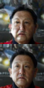
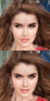
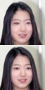
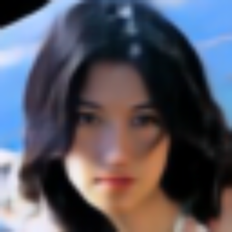
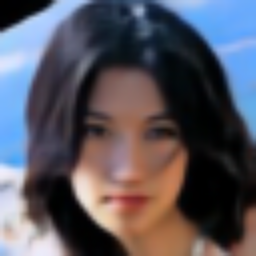
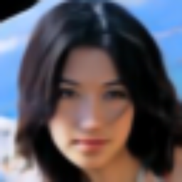
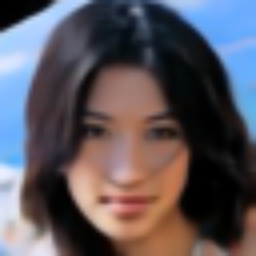
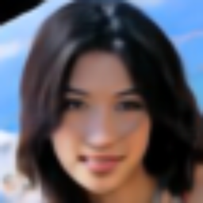

# Glow
This is pytorch implementation of paper "Glow: Generative Flow with Invertible 1x1 Convolutions". Most modules are adapted from the offical TensorFlow version [openai/glow](https://github.com/openai/glow).

# TODO
- [x] Glow model. The model is coded as described in original paper, some functions are adapted from offical TF version. Most modules are tested.
- [x] Trainer, builder and hparams loaded from json.
- [x] Infer after training
- [ ] Test LU_decomposed 1x1 conv2d

# Scripts
- Train a model with
    ```
    train.py <hparams> <dataset> <dataset_root>
    ```
- Generate `z_delta` and manipulate attributes with
    ```
    infer_celeba.py <hparams> <dataset_root> <z_dir>
    ```

# Training result
Currently, I trained model for 25,000 batches with `hparams/celeba.json` using CelebA dataset. In short, I trained with follwing parameters

|      HParam      |            Value            |
| ---------------- | --------------------------- |
| image_shape      | (64, 64, 3)                 |
| hidden_channels  | 512                         |
| K                | 32                          |
| L                | 3                           |
| flow_permutation | invertible 1x1 conv         |
| flow_coupling    | affine                      |
| batch_size       | 12 on each GPU, with 4 GPUs |
| learn_top        | false                       |
| y_condition      | false                       |

- **Reconstruction**:
Following are some samples at training phase. First row is decoded by reversal flowing, second row is the original image.

    
    
    

- **Manipulate attribute**:
Use the method decribed in paper to calculate `z_pos` and `z_neg` for a given attribute.
And `z_delta = z_pos - z_neg` is the direction to manipulate the original image.
(Following images are resized from 64x64 to 256x256)

    - reconstructed:

    
    - manipulate `smile`:

    
    
    
    
    

    
    
    
    
    

# Issues
There might be some errors in my codes. Please help me to figure out.
